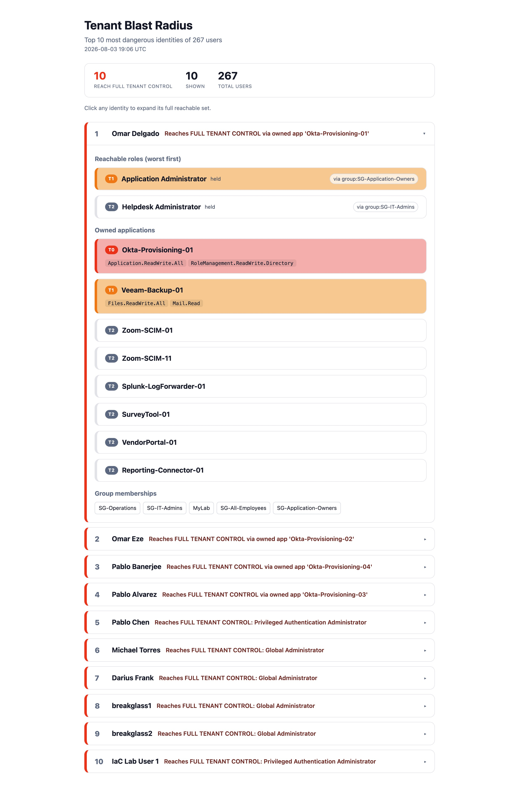

# entra-blast-radius

> **Under active development.** Core reachability, owned-app permission weighting, tenant-wide ranking, and HTML reports work. Transitive escalation and real-tenant scaling are next.

Given an Entra ID identity, compute the complete set of everything it can reach and rank it by the worst privilege at the end. Run it for one identity, or rank every identity in the tenant by blast radius.

## Why

Every identity and incident-response team faces the same question when an account is compromised: *how bad is it?* Native Entra has no single answer. Effective access is scattered across direct role assignments, nested group memberships, PIM-eligible roles, and app ownership, and no one screen ties them together.

This is the inverse of an attack-path scan. An attack-path scan asks "who can reach the crown jewels?" and walks toward privilege. Blast radius starts from an identity and walks outward: if this account is compromised, what does the attacker now control?

## What it computes

For a given principal (by UPN or object id):

- **Direct role assignments** the principal holds.
- **Group memberships**, nesting included (Graph `transitiveMemberOf` resolves nested groups server-side).
- **Roles granted through those groups** — the reach that group membership actually confers.
- **PIM-eligible roles**, direct or via a group — dormant privilege an attacker can activate.
- **Owned applications** — owning an app means controlling its permissions, which can exceed the owner's own roles. An owned app holding a tier-0 Graph permission (e.g. `RoleManagement.ReadWrite.Directory`) is effectively tenant takeover, even when the owner holds no such role directly.

Every reachable item records *how* it is reached, so the output explains itself. The result is ranked worst-first, with the single most dangerous reachable privilege called out as the headline.

## Example output

Tenant-wide mode ranks every identity by blast radius, worst-first, and lets you expand any one to see its full reachable set. Note the top offenders reach full tenant control through an application they *own* — not through any role they hold directly, the kind of path role-based review misses.



## Usage

```
pip install -r requirements.txt
```

Single identity:

```
python blast_radius.py <UPN-or-object-id>          # console
python blast_radius.py <UPN-or-object-id> --html   # + HTML report
```

Tenant-wide (rank every identity, worst-first):

```
python blast_radius.py --tenant                    # top 10, console
python blast_radius.py --tenant --top=25 --html    # top 25, collapsible HTML
```

Authenticates interactively (browser sign-in) using delegated read permissions.

## Scope and honesty

This tool covers the reachability edges listed above. It does **not** yet follow transitive escalation (a role that can grant further roles — e.g. Application Administrator adding credentials to any service principal), Azure resource (ARM) RBAC, group/SP ownership, or PIM-for-groups. Blast radius is only as complete as its edge set; those edges are on the roadmap and the output should not be read as a provably-complete reachability proof.

## Roadmap

- **Transitive escalation** — follow "reaching role X lets you grant Y" chains to their closure, so the blast radius reflects everything a reached role can subsequently unlock.
- Group and service-principal ownership as reachability edges.
- PIM-for-groups (eligible activation into privileged groups).
- Real-tenant scaling: pre-filter to plausibly-privileged principals before computing, so tenant-wide mode stays fast at scale.
- Exclude/tag known admin and break-glass accounts to surface the *unexpected* offenders.
- Used-vs-standing: fold sign-in / audit data to separate active reach from dormant reach.

## Part of a suite

Built alongside [entra-attack-path-visualizer](https://github.com/Dfrank77/entra-attack-path-visualizer) and the [entra-orchestrator](https://github.com/Dfrank77/entra-orchestrator) correlation suite.
